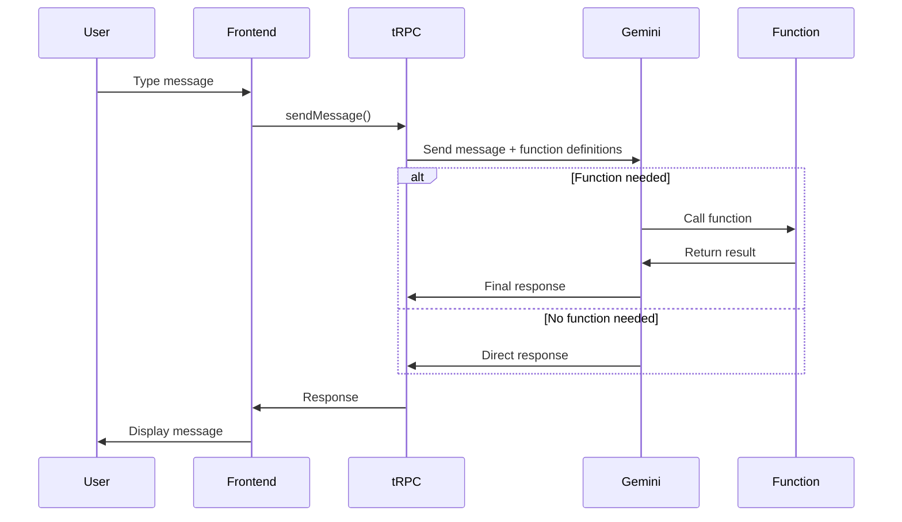

# AI Chatbot Setup Guide

## Overview

This document provides instructions for setting up and testing the AI-powered chatbot with function calling capabilities in the Timetable Manager application.

## Features

- **AI Provider**: Google Gemini 2.0 Flash Experimental
- **Function Calling**: Supports agentic behavior with custom functions
- **Authentication**: Integrates with existing user authentication
- **UI**: Material-UI based chat interface with message bubbles
- **Real-time**: Immediate responses with loading states

## Setup Instructions

### 1. Environment Configuration

Add your Gemini API key to your `.env` file:

```env
GEMINI_API_KEY=your_actual_api_key_here
```

**How to get a Gemini API key:**

1. Visit [Google AI Studio](https://aistudio.google.com/app/apikey)
2. Sign in with your Google account
3. Click "Create API Key"
4. Copy the key and add it to your `.env` file

### 2. Start the Development Server

The dev server should already be running from the setup. If not:

```bash
npm run dev
```

The application will be available at `http://localhost:3000`

### 3. Access the Chatbot

1. Log in to the application
2. Navigate to any timetable: `/tt/{timetableId}`
3. Click on the **"AI Assistant"** tab in the navigation bar
4. You should see the chat interface with a welcome message

## Testing the Hello World Function

### Test Cases

#### Test 1: Basic Function Call

**User Input:**

```
Call the hello world function
```

**Expected Response:**
The AI should recognize this as a function call request and execute the `hello_world` function, returning:

```
Hello, there! 👋 This is a response from the hello_world function. The function calling system is working correctly!
```

#### Test 2: Function Call with Parameter

**User Input:**

```
Call the hello world function with the name "Alice"
```

**Expected Response:**

```
Hello, Alice! 👋 This is a response from the hello_world function. The function calling system is working correctly!
```

#### Test 3: Natural Language Request

**User Input:**

```
Can you greet me? My name is Bob.
```

**Expected Response:**
The AI should understand the intent and call the function:

```
Hello, Bob! 👋 This is a response from the hello_world function. The function calling system is working correctly!
```

#### Test 4: General Conversation

**User Input:**

```
What can you help me with?
```

**Expected Response:**
The AI should respond conversationally without calling functions, explaining its capabilities.

## Architecture Overview

### Backend Components

1. **Gemini Service** (`src/server/services/gemini/`)
   - `client.ts`: Gemini API client with function calling support
   - `functions.ts`: Function definitions and implementations

2. **tRPC Router** (`src/server/trpc/routers/chatbotRouter.ts`)
   - `sendMessage` procedure: Handles chat messages with authentication
   - Validates timetable access
   - Adds context about user and timetable

3. **Environment** (`src/env.ts`)
   - Type-safe environment variable validation
   - Ensures `GEMINI_API_KEY` is present

### Frontend Components

1. **Route** (`src/routes/tt/$timetableId/chatbot.tsx`)
   - Main chatbot page
   - Integrates with tRPC client
   - Handles message sending logic

2. **Chat Interface** (`src/components/Chatbot/ChatInterface.tsx`)
   - Message list with auto-scroll
   - Input field with send button
   - Loading states and error handling
   - Conversation history management

3. **Message Bubble** (`src/components/Chatbot/MessageBubble.tsx`)
   - Styled message display
   - Different styles for user/AI messages
   - Timestamp display
   - Icons for user and AI

4. **Navigation** (`src/components/TimetableNavigationTabs.tsx`)
   - Added "AI Assistant" tab
   - Smart icon integration

## Function Calling Flow



## Adding New Functions

To add new functions to the chatbot:

### 1. Define the Function

Edit `src/server/services/gemini/functions.ts`:

```typescript
export const myNewFunction: FunctionDeclaration = {
  name: "my_new_function",
  description: "Description of what this function does",
  parameters: {
    type: "object",
    properties: {
      param1: {
        type: "string",
        description: "Description of parameter 1",
      },
      // Add more parameters as needed
    },
    required: ["param1"], // Optional: specify required params
  },
};
```

### 2. Implement the Function

Add the implementation to `functionImplementations`:

```typescript
my_new_function: async (args: { param1: string }) => {
  // Your implementation here
  return `Result: ${args.param1}`;
},
```

### 3. Register the Function

Add it to `availableFunctions` array:

```typescript
export const availableFunctions: FunctionDeclaration[] = [
  helloWorldFunction,
  myNewFunction, // Add your new function
];
```

### 4. Test

The AI will automatically be able to call your new function!

## Troubleshooting

### Issue: "GEMINI_API_KEY is required"

**Solution**: Make sure you've added the API key to your `.env` file and restarted the dev server.

### Issue: TypeScript errors in chatbot.tsx

**Solution**: The route types are auto-generated. If errors persist after the dev server starts, try:

```bash
# Stop the dev server (Ctrl+C)
# Restart it
npm run dev
```

### Issue: Function not being called

**Solution**:

1. Check the function definition matches the expected schema
2. Ensure the function name is in `availableFunctions`
3. Ensure the implementation is in `functionImplementations`
4. Check browser console for errors

### Issue: "Timetable not found" error

**Solution**: Make sure you're accessing the chatbot from a valid timetable page that belongs to your organization.

### Issue: Chat not loading

**Solution**:

1. Check browser console for errors
2. Verify the dev server is running
3. Check that you're logged in
4. Verify network requests in browser DevTools

## Next Steps

### Suggested Enhancements

1. **Timetable Query Functions**
   - Get teachers list
   - Get subjects list
   - Search lectures
   - View schedule conflicts

2. **CRUD Operations**
   - Create lectures
   - Update teacher assignments
   - Delete outdated entries

3. **Advanced Features**
   - Conversation persistence (save to database)
   - Streaming responses
   - Voice input/output
   - File upload support
   - Multi-turn function calling

4. **UI Improvements**
   - Code syntax highlighting in messages
   - Markdown support
   - Copy message button
   - Export conversation
   - Dark mode optimizations

## Security Notes

- API key is stored server-side only
- User authentication is validated on every request
- Timetable access is verified
- Function execution is scoped to user's organization
- Rate limiting recommended for production

## Resources

- [Gemini API Documentation](https://ai.google.dev/docs)
- [Function Calling Guide](https://ai.google.dev/docs/function_calling)
- [tRPC Documentation](https://trpc.io)
- [Material-UI Documentation](https://mui.com)

## Support

If you encounter issues:

1. Check the browser console for errors
2. Check the server logs in the terminal
3. Verify environment variables are set correctly
4. Ensure all dependencies are installed
