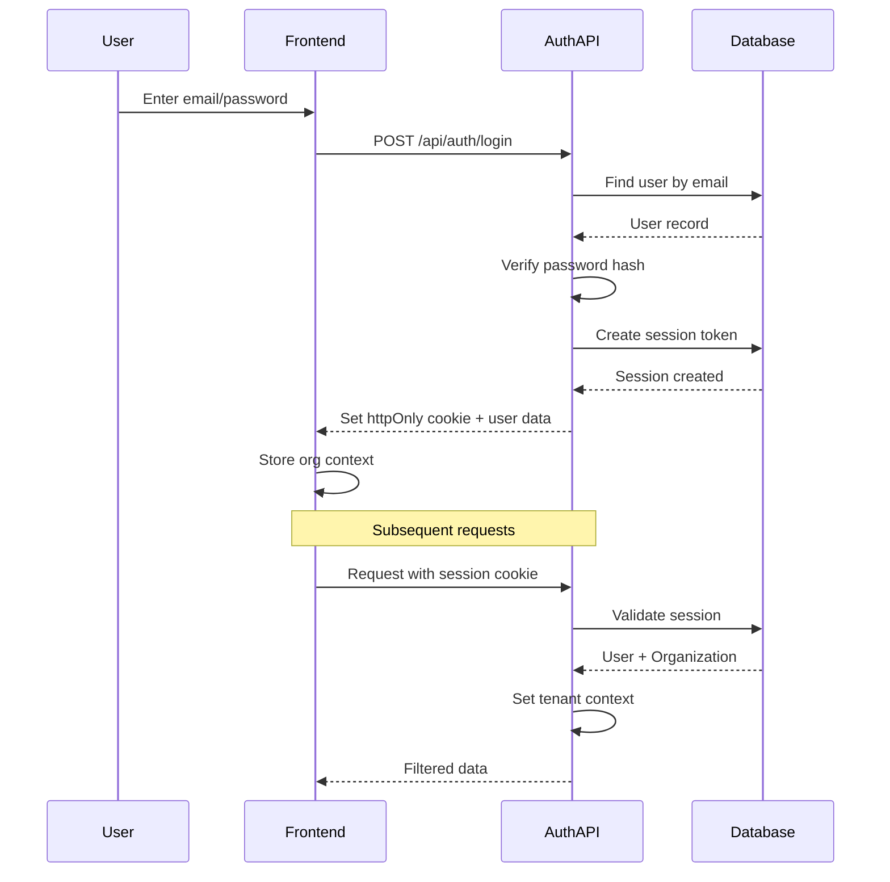
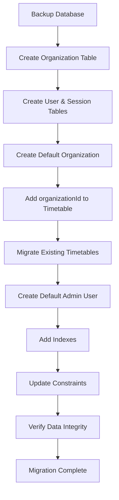

# Multi-Tenancy Architecture Plan

## Overview
Adding organization-based multi-tenancy with complete data isolation to the timetable management system. Each organization (educational institution) will have isolated data with users belonging to a single organization.

## Architecture Model

**Type**: Organization-based multi-tenancy with shared database and application-level tenant filtering

**Key Characteristics**:
- Complete data isolation between organizations
- Users belong to a single organization
- Multiple timetables per organization
- Custom email/password authentication
- Shared database with tenant filtering at application layer

---

## 📊 Database Schema Design

### New Models

#### 1. Organization Model
```prisma
model Organization {
  id          String      @id @default(nanoid(4))
  name        String      @unique
  slug        String      @unique // URL-friendly identifier
  email       String?
  phone       String?
  address     String?
  logoUrl     String?
  isActive    Boolean     @default(true)
  createdAt   DateTime    @default(now())
  updatedAt   DateTime    @updatedAt
  
  // Relations
  users       User[]
  timetables  Timetable[]
}
```

#### 2. User Model (Authentication & Authorization)
```prisma
model User {
  id              String       @id @default(nanoid(4))
  email           String       @unique
  passwordHash    String
  firstName       String
  lastName        String
  role            UserRole     @default(VIEWER)
  isActive        Boolean      @default(true)
  organizationId  String
  createdAt       DateTime     @default(now())
  updatedAt       DateTime     @updatedAt
  lastLoginAt     DateTime?
  
  organization    Organization @relation(fields: [organizationId], references: [id], onDelete: Cascade)
  sessions        Session[]
  
  @@unique([email, organizationId])
  @@index([organizationId])
  @@index([email])
}

enum UserRole {
  ADMIN          // Full access to organization settings and all features
  EDITOR         // Can create/edit timetables, manage teachers, subjects, etc.
  VIEWER         // Read-only access to timetables
}

model Session {
  id        String   @id @default(nanoid(4))
  userId    String
  token     String   @unique
  expiresAt DateTime
  ipAddress String?
  userAgent String?
  createdAt DateTime @default(now())
  
  user      User     @relation(fields: [userId], references: [id], onDelete: Cascade)
  
  @@index([userId])
  @@index([token])
  @@index([expiresAt])
}
```

### Modified Existing Models

#### Timetable Model (Updated)
```prisma
model Timetable {
  id             String        @id @default(nanoid(4))
  name           String
  organizationId String        // NEW: Organization reference
  createdAt      DateTime      @default(now())
  updatedAt      DateTime      @updatedAt
  
  organization   Organization  @relation(fields: [organizationId], references: [id], onDelete: Cascade)
  slots          Slot[]
  groups         Group[]
  subdivisions   Subdivision[]
  teachers       Teacher[]
  classrooms     Classroom[]
  lectures       Lecture[]
  
  @@unique([name, organizationId])  // MODIFIED: Unique within organization
  @@index([organizationId])          // NEW: Performance index
}
```

**Note**: All other models (Teacher, Subject, Classroom, etc.) already have `timetableId` and cascade properly, so they inherit organization isolation through the Timetable relationship.

---

## 🔐 Authentication System

### Authentication Flow



### Authentication Components

#### 1. Password Security
- **Library**: `bcrypt` with cost factor 12
- **Requirements**: Min 8 chars, mix of letters/numbers/symbols
- **Storage**: Never store plain passwords, only hashes

#### 2. Session Management
- **Token**: Secure random 32-byte token (nanoid)
- **Storage**: httpOnly cookies (prevents XSS attacks)
- **Expiration**: 7 days default, configurable
- **Refresh**: Optional refresh token for extended sessions

#### 3. Security Measures
- **Rate Limiting**: Max 5 login attempts per 15 minutes per IP
- **CSRF Protection**: Token-based CSRF protection
- **Session Fixation**: Regenerate session on login
- **Logout**: Immediate session invalidation

### Authentication Endpoints

```typescript
// Auth Router Structure
/api/auth/register       // POST - Create new user (admin only)
/api/auth/login          // POST - Authenticate user
/api/auth/logout         // POST - Invalidate session
/api/auth/me             // GET  - Get current user
/api/auth/refresh        // POST - Refresh session (optional)
/api/auth/change-password // POST - Change user password
```

---

## 🎯 Tenant Context & Middleware

### tRPC Context Enhancement

```typescript
// src/server/trpc/init.ts
export type TrpcContext = {
  prisma: PrismaClient;
  session?: {
    userId: string;
    organizationId: string;
    userRole: UserRole;
  };
};

// Middleware for authentication
export const authedProcedure = t.procedure.use(async (opts) => {
  const sessionToken = opts.ctx.sessionToken; // From cookie
  
  if (!sessionToken) {
    throw new TRPCError({ code: 'UNAUTHORIZED' });
  }
  
  const session = await opts.ctx.prisma.session.findUnique({
    where: { token: sessionToken },
    include: { 
      user: {
        include: { organization: true }
      }
    }
  });
  
  if (!session || session.expiresAt < new Date()) {
    throw new TRPCError({ code: 'UNAUTHORIZED' });
  }
  
  return opts.next({
    ctx: {
      ...opts.ctx,
      session: {
        userId: session.userId,
        organizationId: session.user.organizationId,
        userRole: session.user.role,
      }
    }
  });
});

// Middleware for admin-only operations
export const adminProcedure = authedProcedure.use((opts) => {
  if (opts.ctx.session!.userRole !== 'ADMIN') {
    throw new TRPCError({ code: 'FORBIDDEN' });
  }
  return opts.next();
});
```

### Tenant Filtering Pattern

```typescript
// Example: Get all timetables for current organization
export const timetableRouter = createTRPCRouter({
  list: authedProcedure
    .query(async ({ ctx }) => {
      return ctx.prisma.timetable.findMany({
        where: {
          organizationId: ctx.session!.organizationId // Auto-filtered
        },
        orderBy: { createdAt: 'desc' }
      });
    }),
    
  create: authedProcedure
    .input(z.object({
      name: z.string()
    }))
    .mutation(async ({ ctx, input }) => {
      return ctx.prisma.timetable.create({
        data: {
          name: input.name,
          organizationId: ctx.session!.organizationId // Auto-scoped
        }
      });
    })
});
```

**Critical Rule**: ALL queries must filter by `organizationId` through the timetable relationship or directly if the model has `organizationId`.

---

## 🔄 API Layer Modifications

### Changes Required in All Routers

#### Pattern to Apply
```typescript
// BEFORE (current)
const timetables = await prisma.timetable.findMany();

// AFTER (with tenant filtering)
const timetables = await prisma.timetable.findMany({
  where: { organizationId: ctx.session!.organizationId }
});
```

#### Routers to Modify
1. ✅ [`timetableRouter.ts`](src/server/trpc/routers/timetableRouter.ts) - Add organizationId filter
2. ✅ [`teachersRouter.ts`](src/server/trpc/routers/teachersRouter.ts) - Filter via timetable
3. ✅ [`subjectsRouter.ts`](src/server/trpc/routers/subjectsRouter.ts) - Filter via group → timetable
4. ✅ [`classroomsRouter.ts`](src/server/trpc/routers/classroomsRouter.ts) - Filter via timetable
5. ✅ [`lecturesRouter.ts`](src/server/trpc/routers/lecturesRouter.ts) - Filter via timetable
6. ✅ [`slotsRouter.ts`](src/server/trpc/routers/slotsRouter.ts) - Filter via timetable
7. ✅ All other entity routers - Apply tenant filtering

#### Example Router Update
```typescript
// src/server/trpc/routers/teachersRouter.ts
export const teachersRouter = createTRPCRouter({
  list: authedProcedure
    .input(z.object({
      timetableId: z.string()
    }))
    .query(async ({ ctx, input }) => {
      // Verify timetable belongs to user's organization
      const timetable = await ctx.prisma.timetable.findFirst({
        where: {
          id: input.timetableId,
          organizationId: ctx.session!.organizationId // Tenant check
        }
      });
      
      if (!timetable) {
        throw new TRPCError({ code: 'NOT_FOUND' });
      }
      
      return ctx.prisma.teacher.findMany({
        where: { timetableId: input.timetableId }
      });
    })
});
```

---

## 🎨 UI/UX Changes

### 1. Authentication Pages

#### Login Page (`/login`)
```typescript
// Components needed:
- Email input
- Password input
- Remember me checkbox
- Login button
- Forgot password link
- Error display
```

#### User Profile Page (`/profile`)
```typescript
// Display:
- User info (name, email, role)
- Organization name
- Change password form
- Session management
```

### 2. Organization Management (Admin Only)

#### Organization Settings Page (`/settings/organization`)
```typescript
// Admin features:
- Edit organization details (name, email, phone, address)
- Upload logo
- View organization statistics
- Manage organization-wide settings
```

#### User Management Page (`/settings/users`)
```typescript
// Admin features:
- List all users in organization
- Create new users
- Edit user roles
- Deactivate users
- Reset user passwords
```

### 3. Navigation Updates

#### Header Component Changes
```typescript
// Add to Header:
- User menu dropdown (top-right)
  - Profile
  - Settings (if admin)
  - Logout
- Organization name display
- Role badge
```

### 4. Route Protection

```typescript
// Route guards needed:
- Public routes: /login, /forgot-password
- Protected routes: All existing routes
- Admin-only routes: /settings/organization, /settings/users

// Implementation in router:
<Route path="/settings/organization">
  <RequireAuth>
    <RequireAdmin>
      <OrganizationSettings />
    </RequireAdmin>
  </RequireAuth>
</Route>
```

---

## 🔄 Data Migration Strategy

### Migration Steps



### Migration Script Outline

```typescript
// prisma/migrations/add-multi-tenancy.ts
async function migrate() {
  // 1. Create default organization
  const defaultOrg = await prisma.organization.create({
    data: {
      name: 'Default Organization',
      slug: 'default',
      email: 'admin@example.com'
    }
  });
  
  // 2. Update all existing timetables
  await prisma.timetable.updateMany({
    data: {
      organizationId: defaultOrg.id
    }
  });
  
  // 3. Create default admin user
  const passwordHash = await bcrypt.hash('admin123', 12);
  await prisma.user.create({
    data: {
      email: 'admin@example.com',
      passwordHash,
      firstName: 'Admin',
      lastName: 'User',
      role: 'ADMIN',
      organizationId: defaultOrg.id
    }
  });
  
  console.log('Migration complete!');
  console.log('Default admin credentials:');
  console.log('  Email: admin@example.com');
  console.log('  Password: admin123');
  console.log('  Please change this password immediately!');
}
```

---

## 🛡️ Security Considerations

### Data Isolation Enforcement

#### 1. Database Level
- Indexes on `organizationId` for performance
- Unique constraints include `organizationId`
- Cascade deletes properly configured

#### 2. Application Level
- **Mandatory**: All queries MUST include tenant filter
- **Validation**: Verify tenant ownership before mutations
- **Error Handling**: Never leak cross-tenant data in errors

#### 3. API Level
```typescript
// Security middleware pattern
const verifyTenantAccess = async (
  ctx: TrpcContext,
  resourceId: string,
  resourceType: 'timetable' | 'teacher' | etc
) => {
  const resource = await ctx.prisma[resourceType].findFirst({
    where: {
      id: resourceId,
      timetable: {
        organizationId: ctx.session!.organizationId
      }
    }
  });
  
  if (!resource) {
    throw new TRPCError({ code: 'NOT_FOUND' });
  }
  
  return resource;
};
```

### Attack Prevention

#### 1. SQL Injection
- ✅ Protected by Prisma ORM (parameterized queries)

#### 2. Cross-Tenant Data Access
- ✅ All queries filtered by organizationId
- ✅ Validation before mutations
- ✅ No direct ID-based access without tenant check

#### 3. Authentication Attacks
- ✅ Rate limiting on login endpoint
- ✅ Password complexity requirements
- ✅ Secure session tokens (httpOnly cookies)
- ✅ CSRF protection

#### 4. Authorization Bypass
- ✅ Role-based access control (RBAC)
- ✅ Admin procedures separate from regular procedures
- ✅ Middleware enforces authorization

---

## 📊 Role-Based Access Control (RBAC)

### Role Definitions

| Role | Permissions |
|------|-------------|
| **ADMIN** | - Full access to organization settings<br>- User management (create, edit, delete users)<br>- All timetable operations<br>- Data import/export<br>- View audit logs |
| **EDITOR** | - Create/edit/delete timetables<br>- Manage teachers, subjects, classrooms, lectures<br>- Generate timetables<br>- Export timetables<br>- Cannot manage users or organization settings |
| **VIEWER** | - View all timetables<br>- View teachers, subjects, classrooms<br>- Export timetables (read-only)<br>- Cannot create or modify anything |

### Permission Checks

```typescript
// Helper functions for permission checks
const can = {
  manageUsers: (role: UserRole) => role === 'ADMIN',
  manageOrganization: (role: UserRole) => role === 'ADMIN',
  editTimetables: (role: UserRole) => ['ADMIN', 'EDITOR'].includes(role),
  viewTimetables: (role: UserRole) => true, // All roles can view
  exportData: (role: UserRole) => true, // All roles can export
};

// Usage in procedures
export const createUserProcedure = authedProcedure
  .use((opts) => {
    if (!can.manageUsers(opts.ctx.session!.userRole)) {
      throw new TRPCError({ code: 'FORBIDDEN' });
    }
    return opts.next();
  })
  .mutation(async ({ ctx, input }) => {
    // Create user logic
  });
```

---

## 🧪 Testing Strategy

### Unit Tests
```typescript
// Test tenant isolation
describe('Tenant Isolation', () => {
  it('should not return data from other organizations', async () => {
    const org1 = await createOrganization('Org 1');
    const org2 = await createOrganization('Org 2');
    
    const timetable1 = await createTimetable(org1.id);
    const timetable2 = await createTimetable(org2.id);
    
    const result = await getTimetables({ organizationId: org1.id });
    
    expect(result).toHaveLength(1);
    expect(result[0].id).toBe(timetable1.id);
  });
});
```

### Integration Tests
```typescript
// Test authentication flow
describe('Authentication', () => {
  it('should authenticate and set session', async () => {
    const response = await request(app)
      .post('/api/auth/login')
      .send({ email: 'user@org1.com', password: 'password123' });
    
    expect(response.status).toBe(200);
    expect(response.headers['set-cookie']).toBeDefined();
  });
});
```

### Security Tests
- Cross-tenant access attempts
- Unauthorized access attempts
- SQL injection attempts
- Session hijacking attempts
- CSRF attacks

---

## 📈 Performance Considerations

### Database Optimization
```sql
-- Critical indexes for multi-tenancy
CREATE INDEX idx_timetable_org ON Timetable(organizationId);
CREATE INDEX idx_user_org ON User(organizationId);
CREATE INDEX idx_session_token ON Session(token);
CREATE INDEX idx_session_expires ON Session(expiresAt);
```

### Caching Strategy
- Cache organization data (rarely changes)
- Cache user sessions (check expiration)
- Invalidate caches on organization/user updates

### Query Optimization
- Always include organizationId in WHERE clauses
- Use proper indexes
- Limit number of JOINs
- Paginate large result sets

---

## 🚀 Implementation Phases

### Phase 1: Database & Auth (Week 1-2)
- [ ] Create Organization, User, Session models
- [ ] Update Timetable model with organizationId
- [ ] Implement authentication system
- [ ] Create migration script
- [ ] Test data isolation

### Phase 2: API Layer (Week 2-3)
- [ ] Update tRPC context with tenant info
- [ ] Create auth router
- [ ] Update all existing routers with tenant filtering
- [ ] Implement RBAC middleware
- [ ] Test API security

### Phase 3: UI Components (Week 3-4)
- [ ] Create login page
- [ ] Create user management UI (admin)
- [ ] Create organization settings UI (admin)
- [ ] Update navigation with user menu
- [ ] Implement route guards

### Phase 4: Testing & Security (Week 4-5)
- [ ] Write security tests
- [ ] Penetration testing
- [ ] Load testing
- [ ] Fix identified issues
- [ ] Documentation

### Phase 5: Migration & Deployment (Week 5-6)
- [ ] Run migration on staging
- [ ] User acceptance testing
- [ ] Production migration
- [ ] Monitor for issues
- [ ] Post-deployment verification

---

## 📝 Configuration

### Environment Variables
```bash
# Authentication
SESSION_SECRET=your-secret-key-here
SESSION_EXPIRY_DAYS=7
BCRYPT_ROUNDS=12

# Rate Limiting
LOGIN_RATE_LIMIT_MAX=5
LOGIN_RATE_LIMIT_WINDOW=900000 # 15 minutes in ms

# Security
CSRF_ENABLED=true
SECURE_COOKIES=true # Set to false in development
```

---

## 🔗 Dependencies to Add

```json
{
  "dependencies": {
    "bcrypt": "^5.1.1",
    "nanoid": "^5.0.4",
    "zod": "^3.22.4" // Already present
  },
  "devDependencies": {
    "@types/bcrypt": "^5.0.2"
  }
}
```

---

## 📚 Additional Resources

### Documentation to Create
1. **Admin Guide**: How to manage organizations and users
2. **User Guide**: How to use the system within an organization
3. **API Documentation**: Updated with authentication endpoints
4. **Migration Guide**: Step-by-step migration process
5. **Security Guide**: Best practices and security considerations

### Training Materials
1. User onboarding for different roles
2. Admin training for user management
3. Security awareness training

---

## ✅ Success Criteria

### Security
- ✅ No cross-tenant data leakage
- ✅ All authentication tests pass
- ✅ RBAC correctly enforced
- ✅ Rate limiting working

### Functionality
- ✅ Users can log in and out
- ✅ Admins can manage users
- ✅ All existing features work with tenant isolation
- ✅ Data migration successful

### Performance
- ✅ Login < 1 second
- ✅ Page loads < 2 seconds
- ✅ Database queries optimized with indexes

### User Experience
- ✅ Intuitive login flow
- ✅ Clear role indicators
- ✅ Helpful error messages
- ✅ Smooth navigation