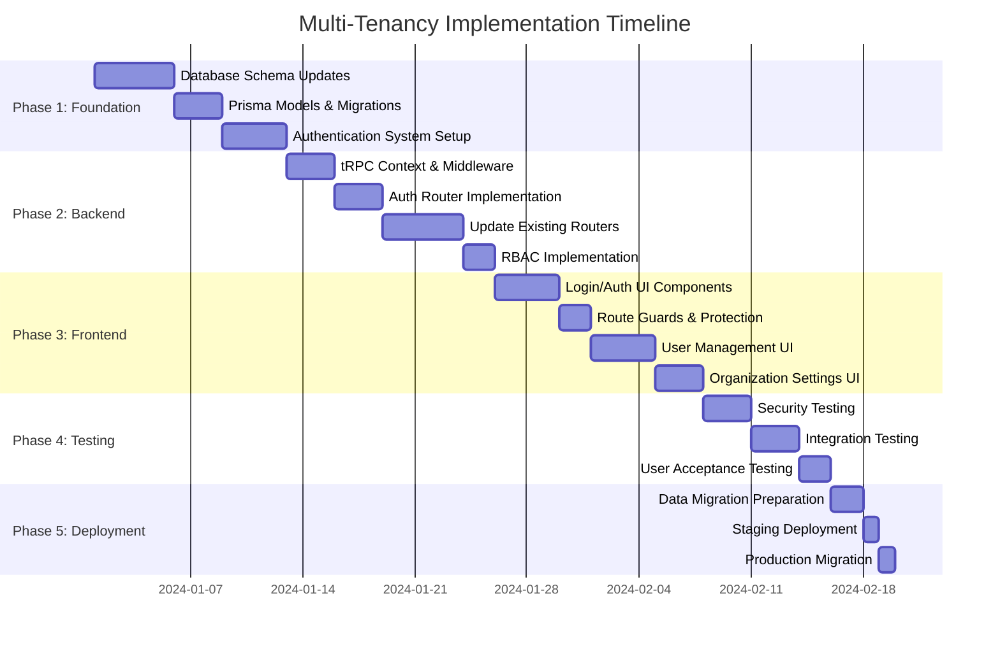

# Multi-Tenancy Implementation Guide

## 📋 Quick Reference

This guide provides step-by-step implementation instructions with complete code examples for adding multi-tenancy to the timetable management system.

---

## 🗺️ Implementation Roadmap



---

## 📝 Step-by-Step Implementation

### Phase 1: Database Schema & Authentication

#### Step 1.1: Add New Prisma Schema Files

**Create: `prisma/schema/Organization.prisma`**
```prisma
model Organization {
  id          String      @id @default(nanoid(4))
  name        String      @unique
  slug        String      @unique
  email       String?
  phone       String?
  address     String?
  logoUrl     String?
  isActive    Boolean     @default(true)
  createdAt   DateTime    @default(now())
  updatedAt   DateTime    @updatedAt
  
  users       User[]
  timetables  Timetable[]
}
```

**Create: `prisma/schema/User.prisma`**
```prisma
model User {
  id              String       @id @default(nanoid(4))
  email           String       @unique
  passwordHash    String
  firstName       String
  lastName        String
  role            UserRole     @default(VIEWER)
  isActive        Boolean      @default(true)
  organizationId  String
  createdAt       DateTime     @default(now())
  updatedAt       DateTime     @updatedAt
  lastLoginAt     DateTime?
  
  organization    Organization @relation(fields: [organizationId], references: [id], onDelete: Cascade)
  sessions        Session[]
  
  @@unique([email, organizationId])
  @@index([organizationId])
  @@index([email])
}

enum UserRole {
  ADMIN
  EDITOR
  VIEWER
}

model Session {
  id        String   @id @default(nanoid(4))
  userId    String
  token     String   @unique
  expiresAt DateTime
  ipAddress String?
  userAgent String?
  createdAt DateTime @default(now())
  
  user      User     @relation(fields: [userId], references: [id], onDelete: Cascade)
  
  @@index([userId])
  @@index([token])
  @@index([expiresAt])
}
```

**Update: `prisma/schema/Timetable.prisma`**
```prisma
model Timetable {
  id             String        @id @default(nanoid(4))
  name           String
  organizationId String        // ADD THIS
  createdAt      DateTime      @default(now())
  updatedAt      DateTime      @updatedAt
  
  organization   Organization  @relation(fields: [organizationId], references: [id], onDelete: Cascade)  // ADD THIS
  slots          Slot[]
  groups         Group[]
  subdivisions   Subdivision[]
  teachers       Teacher[]
  classrooms     Classroom[]
  lectures       Lecture[]
  
  @@unique([name, organizationId])  // MODIFY THIS
  @@index([organizationId])          // ADD THIS
}
```

**Update: `prisma/schema/index.prisma`**
```prisma
// Add after the existing model imports
import "Organization.prisma"
import "User.prisma"
```

#### Step 1.2: Generate and Run Migration

```bash
# Generate Prisma client
npx prisma generate

# Create migration
npx prisma migrate dev --name add-multi-tenancy

# If you have existing data, see Step 1.3 for migration script
```

#### Step 1.3: Data Migration Script

**Create: `scripts/migrate-to-multi-tenancy.ts`**
```typescript
import { PrismaClient } from '@/generated/prisma';
import * as bcrypt from 'bcrypt';

const prisma = new PrismaClient();

async function migrateToMultiTenancy() {
  console.log('Starting multi-tenancy migration...');
  
  try {
    // Step 1: Create default organization
    console.log('Creating default organization...');
    const defaultOrg = await prisma.organization.create({
      data: {
        name: 'Default Organization',
        slug: 'default',
        email: 'admin@example.com',
        isActive: true,
      },
    });
    console.log(`✓ Created organization: ${defaultOrg.name} (${defaultOrg.id})`);
    
    // Step 2: Update all existing timetables
    console.log('Migrating existing timetables...');
    const timetableCount = await prisma.timetable.count();
    
    await prisma.timetable.updateMany({
      data: {
        organizationId: defaultOrg.id,
      },
    });
    console.log(`✓ Migrated ${timetableCount} timetables`);
    
    // Step 3: Create default admin user
    console.log('Creating default admin user...');
    const defaultPassword = 'ChangeMe123!';
    const passwordHash = await bcrypt.hash(defaultPassword, 12);
    
    const adminUser = await prisma.user.create({
      data: {
        email: 'admin@example.com',
        passwordHash,
        firstName: 'Admin',
        lastName: 'User',
        role: 'ADMIN',
        isActive: true,
        organizationId: defaultOrg.id,
      },
    });
    console.log(`✓ Created admin user: ${adminUser.email}`);
    
    console.log('\n✅ Migration completed successfully!');
    console.log('\n⚠️  IMPORTANT: Default admin credentials:');
    console.log(`   Email: ${adminUser.email}`);
    console.log(`   Password: ${defaultPassword}`);
    console.log('   Please change this password immediately after first login!\n');
    
  } catch (error) {
    console.error('❌ Migration failed:', error);
    throw error;
  } finally {
    await prisma.$disconnect();
  }
}

// Run migration
migrateToMultiTenancy()
  .catch((error) => {
    console.error(error);
    process.exit(1);
  });
```

**Run the migration:**
```bash
npx tsx scripts/migrate-to-multi-tenancy.ts
```

---

### Phase 2: Backend Implementation

#### Step 2.1: Install Dependencies

```bash
npm install bcrypt nanoid
npm install -D @types/bcrypt
```

#### Step 2.2: Update tRPC Context

**Update: `src/server/trpc/init.ts`**
```typescript
import { initTRPC, TRPCError } from "@trpc/server";
import superjson from "superjson";
import { prisma } from "@/server/prisma";
import type { UserRole } from "@/generated/prisma";

export function createContext() {
  return {
    prisma,
  };
}

export type TrpcContext = Awaited<ReturnType<typeof createContext>> & {
  session?: {
    userId: string;
    organizationId: string;
    userRole: UserRole;
    userEmail: string;
  };
  sessionToken?: string;
};

const t = initTRPC.context<TrpcContext>().create({
  transformer: superjson,
});

export const createTRPCRouter = t.router;
export const publicProcedure = t.procedure;

// Authentication middleware
export const authedProcedure = t.procedure.use(async (opts) => {
  const sessionToken = opts.ctx.sessionToken;
  
  if (!sessionToken) {
    throw new TRPCError({ 
      code: 'UNAUTHORIZED',
      message: 'No session token provided'
    });
  }
  
  // Validate session
  const session = await opts.ctx.prisma.session.findUnique({
    where: { token: sessionToken },
    include: { 
      user: {
        include: { organization: true }
      }
    }
  });
  
  if (!session || session.expiresAt < new Date()) {
    throw new TRPCError({ 
      code: 'UNAUTHORIZED',
      message: 'Invalid or expired session'
    });
  }
  
  // Check if user is active
  if (!session.user.isActive) {
    throw new TRPCError({ 
      code: 'FORBIDDEN',
      message: 'User account is inactive'
    });
  }
  
  // Check if organization is active
  if (!session.user.organization.isActive) {
    throw new TRPCError({ 
      code: 'FORBIDDEN',
      message: 'Organization is inactive'
    });
  }
  
  return opts.next({
    ctx: {
      ...opts.ctx,
      session: {
        userId: session.userId,
        organizationId: session.user.organizationId,
        userRole: session.user.role,
        userEmail: session.user.email,
      }
    }
  });
});

// Admin-only middleware
export const adminProcedure = authedProcedure.use((opts) => {
  if (opts.ctx.session!.userRole !== 'ADMIN') {
    throw new TRPCError({ 
      code: 'FORBIDDEN',
      message: 'Admin access required'
    });
  }
  return opts.next();
});

// Editor or Admin middleware
export const editorProcedure = authedProcedure.use((opts) => {
  const allowedRoles: UserRole[] = ['ADMIN', 'EDITOR'];
  if (!allowedRoles.includes(opts.ctx.session!.userRole)) {
    throw new TRPCError({ 
      code: 'FORBIDDEN',
      message: 'Editor or Admin access required'
    });
  }
  return opts.next();
});
```

#### Step 2.3: Create Authentication Router

**Create: `src/server/trpc/routers/authRouter.ts`**
```typescript
import { z } from "zod";
import { TRPCError } from "@trpc/server";
import * as bcrypt from "bcrypt";
import { nanoid } from "nanoid";
import { createTRPCRouter, publicProcedure, authedProcedure, adminProcedure } from "../init";

const BCRYPT_ROUNDS = 12;
const SESSION_EXPIRY_DAYS = 7;

export const authRouter = createTRPCRouter({
  // Login
  login: publicProcedure
    .input(z.object({
      email: z.string().email(),
      password: z.string().min(8),
    }))
    .mutation(async ({ ctx, input }) => {
      // Find user
      const user = await ctx.prisma.user.findUnique({
        where: { email: input.email },
        include: { organization: true }
      });
      
      if (!user) {
        throw new TRPCError({
          code: 'UNAUTHORIZED',
          message: 'Invalid credentials'
        });
      }
      
      // Check if user is active
      if (!user.isActive) {
        throw new TRPCError({
          code: 'FORBIDDEN',
          message: 'Account is inactive'
        });
      }
      
      // Check if organization is active
      if (!user.organization.isActive) {
        throw new TRPCError({
          code: 'FORBIDDEN',
          message: 'Organization is inactive'
        });
      }
      
      // Verify password
      const isPasswordValid = await bcrypt.compare(input.password, user.passwordHash);
      if (!isPasswordValid) {
        throw new TRPCError({
          code: 'UNAUTHORIZED',
          message: 'Invalid credentials'
        });
      }
      
      // Create session
      const expiresAt = new Date();
      expiresAt.setDate(expiresAt.getDate() + SESSION_EXPIRY_DAYS);
      
      const session = await ctx.prisma.session.create({
        data: {
          userId: user.id,
          token: nanoid(32),
          expiresAt,
        }
      });
      
      // Update last login
      await ctx.prisma.user.update({
        where: { id: user.id },
        data: { lastLoginAt: new Date() }
      });
      
      return {
        token: session.token,
        user: {
          id: user.id,
          email: user.email,
          firstName: user.firstName,
          lastName: user.lastName,
          role: user.role,
          organizationId: user.organizationId,
          organizationName: user.organization.name,
        }
      };
    }),
  
  // Logout
  logout: authedProcedure
    .mutation(async ({ ctx }) => {
      if (ctx.sessionToken) {
        await ctx.prisma.session.delete({
          where: { token: ctx.sessionToken }
        }).catch(() => {
          // Session might not exist, ignore error
        });
      }
      return { success: true };
    }),
  
  // Get current user
  me: authedProcedure
    .query(async ({ ctx }) => {
      const user = await ctx.prisma.user.findUnique({
        where: { id: ctx.session!.userId },
        include: { organization: true }
      });
      
      if (!user) {
        throw new TRPCError({
          code: 'NOT_FOUND',
          message: 'User not found'
        });
      }
      
      return {
        id: user.id,
        email: user.email,
        firstName: user.firstName,
        lastName: user.lastName,
        role: user.role,
        organizationId: user.organizationId,
        organizationName: user.organization.name,
        organizationSlug: user.organization.slug,
        lastLoginAt: user.lastLoginAt,
      };
    }),
  
  // Change password
  changePassword: authedProcedure
    .input(z.object({
      currentPassword: z.string(),
      newPassword: z.string().min(8).regex(
        /^(?=.*[a-z])(?=.*[A-Z])(?=.*\d)(?=.*[@$!%*?&])[A-Za-z\d@$!%*?&]/,
        'Password must contain uppercase, lowercase, number and special character'
      ),
    }))
    .mutation(async ({ ctx, input }) => {
      const user = await ctx.prisma.user.findUnique({
        where: { id: ctx.session!.userId }
      });
      
      if (!user) {
        throw new TRPCError({ code: 'NOT_FOUND' });
      }
      
      // Verify current password
      const isValid = await bcrypt.compare(input.currentPassword, user.passwordHash);
      if (!isValid) {
        throw new TRPCError({
          code: 'BAD_REQUEST',
          message: 'Current password is incorrect'
        });
      }
      
      // Hash new password
      const newPasswordHash = await bcrypt.hash(input.newPassword, BCRYPT_ROUNDS);
      
      // Update password
      await ctx.prisma.user.update({
        where: { id: user.id },
        data: { passwordHash: newPasswordHash }
      });
      
      // Invalidate all other sessions
      await ctx.prisma.session.deleteMany({
        where: {
          userId: user.id,
          token: { not: ctx.sessionToken }
        }
      });
      
      return { success: true };
    }),
  
  // Create user (Admin only)
  createUser: adminProcedure
    .input(z.object({
      email: z.string().email(),
      firstName: z.string().min(1),
      lastName: z.string().min(1),
      role: z.enum(['ADMIN', 'EDITOR', 'VIEWER']),
      password: z.string().min(8),
    }))
    .mutation(async ({ ctx, input }) => {
      // Check if user already exists in this organization
      const existingUser = await ctx.prisma.user.findFirst({
        where: {
          email: input.email,
          organizationId: ctx.session!.organizationId
        }
      });
      
      if (existingUser) {
        throw new TRPCError({
          code: 'CONFLICT',
          message: 'User with this email already exists'
        });
      }
      
      // Hash password
      const passwordHash = await bcrypt.hash(input.password, BCRYPT_ROUNDS);
      
      // Create user
      const user = await ctx.prisma.user.create({
        data: {
          email: input.email,
          firstName: input.firstName,
          lastName: input.lastName,
          role: input.role,
          passwordHash,
          organizationId: ctx.session!.organizationId,
        }
      });
      
      return {
        id: user.id,
        email: user.email,
        firstName: user.firstName,
        lastName: user.lastName,
        role: user.role,
      };
    }),
  
  // List users (Admin only)
  listUsers: adminProcedure
    .query(async ({ ctx }) => {
      const users = await ctx.prisma.user.findMany({
        where: { organizationId: ctx.session!.organizationId },
        orderBy: { createdAt: 'desc' },
        select: {
          id: true,
          email: true,
          firstName: true,
          lastName: true,
          role: true,
          isActive: true,
          lastLoginAt: true,
          createdAt: true,
        }
      });
      
      return users;
    }),
  
  // Update user (Admin only)
  updateUser: adminProcedure
    .input(z.object({
      userId: z.string(),
      firstName: z.string().optional(),
      lastName: z.string().optional(),
      role: z.enum(['ADMIN', 'EDITOR', 'VIEWER']).optional(),
      isActive: z.boolean().optional(),
    }))
    .mutation(async ({ ctx, input }) => {
      const { userId, ...updateData } = input;
      
      // Verify user belongs to same organization
      const user = await ctx.prisma.user.findFirst({
        where: {
          id: userId,
          organizationId: ctx.session!.organizationId
        }
      });
      
      if (!user) {
        throw new TRPCError({ code: 'NOT_FOUND' });
      }
      
      // Prevent admin from deactivating themselves
      if (userId === ctx.session!.userId && updateData.isActive === false) {
        throw new TRPCError({
          code: 'BAD_REQUEST',
          message: 'Cannot deactivate your own account'
        });
      }
      
      const updatedUser = await ctx.prisma.user.update({
        where: { id: userId },
        data: updateData,
      });
      
      return {
        id: updatedUser.id,
        email: updatedUser.email,
        firstName: updatedUser.firstName,
        lastName: updatedUser.lastName,
        role: updatedUser.role,
        isActive: updatedUser.isActive,
      };
    }),
});
```

#### Step 2.4: Update Root Router

**Update: `src/server/trpc/routers/index.ts`**
```typescript
import { createTRPCRouter } from "../init";
import { authRouter } from "./authRouter";
// ... import other routers

export const appRouter = createTRPCRouter({
  auth: authRouter,
  // ... other routers
});

export type AppRouter = typeof appRouter;
```

#### Step 2.5: Update Existing Routers with Tenant Filtering

**Example: Update `src/server/trpc/routers/timetableRouter.ts`**
```typescript
import { z } from "zod";
import { TRPCError } from "@trpc/server";
import { createTRPCRouter, authedProcedure, editorProcedure } from "../init";

export const timetableRouter = createTRPCRouter({
  // List timetables (filtered by organization)
  list: authedProcedure
    .query(async ({ ctx }) => {
      return ctx.prisma.timetable.findMany({
        where: {
          organizationId: ctx.session!.organizationId  // TENANT FILTER
        },
        orderBy: { createdAt: 'desc' }
      });
    }),
  
  // Get single timetable
  get: authedProcedure
    .input(z.object({
      id: z.string()
    }))
    .query(async ({ ctx, input }) => {
      const timetable = await ctx.prisma.timetable.findFirst({
        where: {
          id: input.id,
          organizationId: ctx.session!.organizationId  // TENANT FILTER
        },
        include: {
          slots: true,
          groups: true,
          // ... other includes
        }
      });
      
      if (!timetable) {
        throw new TRPCError({ code: 'NOT_FOUND' });
      }
      
      return timetable;
    }),
  
  // Create timetable (Editor or Admin only)
  create: editorProcedure
    .input(z.object({
      name: z.string().min(1)
    }))
    .mutation(async ({ ctx, input }) => {
      return ctx.prisma.timetable.create({
        data: {
          name: input.name,
          organizationId: ctx.session!.organizationId  // AUTO-SCOPE TO TENANT
        }
      });
    }),
  
  // Update timetable
  update: editorProcedure
    .input(z.object({
      id: z.string(),
      name: z.string().min(1)
    }))
    .mutation(async ({ ctx, input }) => {
      // Verify ownership
      const timetable = await ctx.prisma.timetable.findFirst({
        where: {
          id: input.id,
          organizationId: ctx.session!.organizationId
        }
      });
      
      if (!timetable) {
        throw new TRPCError({ code: 'NOT_FOUND' });
      }
      
      return ctx.prisma.timetable.update({
        where: { id: input.id },
        data: { name: input.name }
      });
    }),
  
  // Delete timetable
  delete: editorProcedure
    .input(z.object({
      id: z.string()
    }))
    .mutation(async ({ ctx, input }) => {
      // Verify ownership
      const timetable = await ctx.prisma.timetable.findFirst({
        where: {
          id: input.id,
          organizationId: ctx.session!.organizationId
        }
      });
      
      if (!timetable) {
        throw new TRPCError({ code: 'NOT_FOUND' });
      }
      
      return ctx.prisma.timetable.delete({
        where: { id: input.id }
      });
    }),
});
```

**Apply the same pattern to all other routers:**
- [`teachersRouter.ts`](src/server/trpc/routers/teachersRouter.ts)
- [`subjectsRouter.ts`](src/server/trpc/routers/subjectsRouter.ts)
- [`classroomsRouter.ts`](src/server/trpc/routers/classroomsRouter.ts)
- [`lecturesRouter.ts`](src/server/trpc/routers/lecturesRouter.ts)
- All other entity routers

---

### Phase 3: Frontend Implementation

#### Step 3.1: Update tRPC Client with Session Token

**Update: `src/integrations/trpc.ts`**
```typescript
import { createTRPCReact } from '@trpc/react-query';
import { httpBatchLink } from '@trpc/client';
import type { AppRouter } from '@/server/trpc/routers';
import superjson from 'superjson';

export const trpc = createTRPCReact<AppRouter>();

export function getTRPCClient() {
  return trpc.createClient({
    links: [
      httpBatchLink({
        url: '/api/trpc',
        transformer: superjson,
        headers() {
          // Get session token from cookie
          const token = document.cookie
            .split('; ')
            .find(row => row.startsWith('session='))
            ?.split('=')[1];
          
          return {
            'x-session-token': token || '',
          };
        },
      }),
    ],
  });
}
```

**Update: `src/routes/api/trpc.$.tsx`** (tRPC handler)
```typescript
import { fetchRequestHandler } from '@trpc/server/adapters/fetch';
import { appRouter } from '@/server/trpc/routers';
import { createContext } from '@/server/trpc/init';

export async function loader({ request }: { request: Request }) {
  // Extract session token from cookie or header
  const sessionToken = request.headers.get('x-session-token') || 
    request.headers.get('cookie')
      ?.split('; ')
      .find(row => row.startsWith('session='))
      ?.split('=')[1];
  
  return fetchRequestHandler({
    endpoint: '/api/trpc',
    req: request,
    router: appRouter,
    createContext: () => ({
      ...createContext(),
      sessionToken,
    }),
  });
}

export const action = loader;
```

#### Step 3.2: Create Authentication Store

**Create: `src/zustand/authStore.tsx`**
```typescript
import { create } from 'zustand';
import { persist } from 'zustand/middleware';

interface User {
  id: string;
  email: string;
  firstName: string;
  lastName: string;
  role: 'ADMIN' | 'EDITOR' | 'VIEWER';
  organizationId: string;
  organizationName: string;
}

interface AuthState {
  user: User | null;
  isAuthenticated: boolean;
  setUser: (user: User | null) => void;
  logout: () => void;
}

export const useAuthStore = create<AuthState>()(
  persist(
    (set) => ({
      user: null,
      isAuthenticated: false,
      setUser: (user) => set({ user, isAuthenticated: !!user }),
      logout: () => {
        // Clear session cookie
        document.cookie = 'session=; Max-Age=0; path=/;';
        set({ user: null, isAuthenticated: false });
      },
    }),
    {
      name: 'auth-storage',
    }
  )
);
```

#### Step 3.3: Create Login Page

**Create: `src/routes/login.tsx`**
```typescript
import { useState } from 'react';
import { useNavigate } from '@tanstack/react-router';
import { 
  Container, 
  Card, 
  CardContent, 
  TextField, 
  Button, 
  Typography, 
  Alert,
  Box 
} from '@mui/material';
import { trpc } from '@/integrations/trpc';
import { useAuthStore } from '@/zustand/authStore';

export function LoginPage() {
  const navigate = useNavigate();
  const setUser = useAuthStore(state => state.setUser);
  
  const [email, setEmail] = useState('');
  const [password, setPassword] = useState('');
  const [error, setError] = useState('');
  
  const loginMutation = trpc.auth.login.useMutation({
    onSuccess: (data) => {
      // Set session cookie
      document.cookie = `session=${data.token}; path=/; max-age=${7 * 24 * 60 * 60}; SameSite=Strict`;
      
      // Update auth store
      setUser(data.user);
      
      // Redirect to home
      navigate({ to: '/' });
    },
    onError: (error) => {
      setError(error.message);
    },
  });
  
  const handleSubmit = (e: React.FormEvent) => {
    e.preventDefault();
    setError('');
    loginMutation.mutate({ email, password });
  };
  
  return (
    <Container maxWidth="sm" sx={{ mt: 8 }}>
      <Card>
        <CardContent>
          <Typography variant="h4" component="h1" gutterBottom align="center">
            Timetable Manager
          </Typography>
          <Typography variant="h6" component="h2" gutterBottom align="center" color="text.secondary">
            Sign In
          </Typography>
          
          {error && (
            <Alert severity="error" sx={{ mb: 2 }}>
              {error}
            </Alert>
          )}
          
          <Box component="form" onSubmit={handleSubmit}>
            <TextField
              fullWidth
              label="Email"
              type="email"
              value={email}
              onChange={(e) => setEmail(e.target.value)}
              margin="normal"
              required
              autoFocus
            />
            
            <TextField
              fullWidth
              label="Password"
              type="password"
              value={password}
              onChange={(e) => setPassword(e.target.value)}
              margin="normal"
              required
            />
            
            <Button
              fullWidth
              type="submit"
              variant="contained"
              size="large"
              disabled={loginMutation.isPending}
              sx={{ mt: 3 }}
            >
              {loginMutation.isPending ? 'Signing in...' : 'Sign In'}
            </Button>
          </Box>
        </CardContent>
      </Card>
    </Container>
  );
}
```

#### Step 3.4: Create Route Guard

**Create: `src/components/RequireAuth.tsx`**
```typescript
import { useEffect } from 'react';
import { useNavigate } from '@tanstack/react-router';
import { CircularProgress, Box } from '@mui/material';
import { useAuthStore } from '@/zustand/authStore';
import { trpc } from '@/integrations/trpc';

interface RequireAuthProps {
  children: React.ReactNode;
  requiredRole?: 'ADMIN' | 'EDITOR' | 'VIEWER';
}

export function RequireAuth({ children, requiredRole }: RequireAuthProps) {
  const navigate = useNavigate();
  const { user, isAuthenticated, setUser } = useAuthStore();
  
  // Verify session with server
  const { data, isLoading, error } = trpc.auth.me.useQuery(undefined, {
    retry: false,
    enabled: isAuthenticated,
  });
  
  useEffect(() => {
    if (!isAuthenticated || error) {
      navigate({ to: '/login' });
    } else if (data && !user) {
      // Update user from server
      setUser(data as any);
    }
  }, [isAuthenticated, error, data, user, setUser, navigate]);
  
  // Check role-based access
  useEffect(() => {
    if (user && requiredRole) {
      const roleHierarchy = { VIEWER: 1, EDITOR: 2, ADMIN: 3 };
      const userLevel = roleHierarchy[user.role];
      const requiredLevel = roleHierarchy[requiredRole];
      
      if (userLevel < requiredLevel) {
        navigate({ to: '/' });
      }
    }
  }, [user, requiredRole, navigate]);
  
  if (isLoading) {
    return (
      <Box display="flex" justifyContent="center" alignItems="center" minHeight="100vh">
        <CircularProgress />
      </Box>
    );
  }
  
  if (!isAuthenticated || !user) {
    return null;
  }
  
  return <>{children}</>;
}
```

#### Step 3.5: Update Header with User Menu

**Update: `src/components/Header.tsx`**
```typescript
import { useState } from 'react';
import { useNavigate } from '@tanstack/react-router';
import { 
  AppBar, 
  Toolbar, 
  Typography, 
  IconButton, 
  Menu, 
  MenuItem,
  Avatar,
  Chip,
  Box 
} from '@mui/material';
import { AccountCircle, Settings, Logout } from '@mui/icons-material';
import { useAuthStore } from '@/zustand/authStore';
import { trpc } from '@/integrations/trpc';

export function Header() {
  const navigate = useNavigate();
  const { user, logout } = useAuthStore();
  const [anchorEl, setAnchorEl] = useState<null | HTMLElement>(null);
  
  const logoutMutation = trpc.auth.logout.useMutation({
    onSuccess: () => {
      logout();
      navigate({ to: '/login' });
    },
  });
  
  const handleMenuOpen = (event: React.MouseEvent<HTMLElement>) => {
    setAnchorEl(event.currentTarget);
  };
  
  const handleMenuClose = () => {
    setAnchorEl(null);
  };
  
  const handleLogout = () => {
    handleMenuClose();
    logoutMutation.mutate();
  };
  
  const handleSettings = () => {
    handleMenuClose();
    navigate({ to: '/settings' });
  };
  
  if (!user) return null;
  
  return (
    <AppBar position="static">
      <Toolbar>
        <Typography variant="h6" component="div" sx={{ flexGrow: 1 }}>
          Timetable Manager
        </Typography>
        
        <Box sx={{ display: 'flex', alignItems: 'center', gap: 2 }}>
          <Typography variant="body2">
            {user.organizationName}
          </Typography>
          
          <Chip 
            label={user.role} 
            size="small" 
            color={user.role === 'ADMIN' ? 'error' : user.role === 'EDITOR' ? 'warning' : 'default'}
          />
          
          <IconButton
            onClick={handleMenuOpen}
            size="large"
            color="inherit"
          >
            <Avatar sx={{ width: 32, height: 32 }}>
              {user.firstName[0]}{user.lastName[0]}
            </Avatar>
          </IconButton>
          
          <Menu
            anchorEl={anchorEl}
            open={Boolean(anchorEl)}
            onClose={handleMenuClose}
          >
            <MenuItem disabled>
              <Typography variant="body2">
                {user.firstName} {user.lastName}
              </Typography>
            </MenuItem>
            <MenuItem disabled>
              <Typography variant="caption" color="text.secondary">
                {user.email}
              </Typography>
            </MenuItem>
            
            {user.role === 'ADMIN' && (
              <MenuItem onClick={handleSettings}>
                <Settings fontSize="small" sx={{ mr: 1 }} />
                Settings
              </MenuItem>
            )}
            
            <MenuItem onClick={handleLogout}>
              <Logout fontSize="small" sx={{ mr: 1 }} />
              Logout
            </MenuItem>
          </Menu>
        </Box>
      </Toolbar>
    </AppBar>
  );
}
```

#### Step 3.6: Create User Management Page (Admin)

**Create: `src/routes/settings/users.tsx`**
```typescript
import { useState } from 'react';
import {
  Container,
  Card,
  CardContent,
  Typography,
  Button,
  Table,
  TableBody,
  TableCell,
  TableContainer,
  TableHead,
  TableRow,
  Chip,
  IconButton,
  Dialog,
  DialogTitle,
  DialogContent,
  DialogActions,
  TextField,
  Select,
  MenuItem,
  FormControl,
  InputLabel,
} from '@mui/material';
import { Edit, PersonAdd } from '@mui/icons-material';
import { trpc } from '@/integrations/trpc';
import { RequireAuth } from '@/components/RequireAuth';

function UserManagementContent() {
  const [dialogOpen, setDialogOpen] = useState(false);
  const [formData, setFormData] = useState({
    email: '',
    firstName: '',
    lastName: '',
    role: 'VIEWER' as 'ADMIN' | 'EDITOR' | 'VIEWER',
    password: '',
  });
  
  const { data: users, refetch } = trpc.auth.listUsers.useQuery();
  
  const createUserMutation = trpc.auth.createUser.useMutation({
    onSuccess: () => {
      refetch();
      setDialogOpen(false);
      setFormData({
        email: '',
        firstName: '',
        lastName: '',
        role: 'VIEWER',
        password: '',
      });
    },
  });
  
  const handleSubmit = (e: React.FormEvent) => {
    e.preventDefault();
    createUserMutation.mutate(formData);
  };
  
  return (
    <Container maxWidth="lg" sx={{ mt: 4 }}>
      <Card>
        <CardContent>
          <Box display="flex" justifyContent="space-between" alignItems="center" mb={3}>
            <Typography variant="h5">User Management</Typography>
            <Button
              variant="contained"
              startIcon={<PersonAdd />}
              onClick={() => setDialogOpen(true)}
            >
              Add User
            </Button>
          </Box>
          
          <TableContainer>
            <Table>
              <TableHead>
                <TableRow>
                  <TableCell>Name</TableCell>
                  <TableCell>Email</TableCell>
                  <TableCell>Role</TableCell>
                  <TableCell>Status</TableCell>
                  <TableCell>Last Login</TableCell>
                  <TableCell>Actions</TableCell>
                </TableRow>
              </TableHead>
              <TableBody>
                {users?.map((user) => (
                  <TableRow key={user.id}>
                    <TableCell>
                      {user.firstName} {user.lastName}
                    </TableCell>
                    <TableCell>{user.email}</TableCell>
                    <TableCell>
                      <Chip 
                        label={user.role} 
                        size="small"
                        color={
                          user.role === 'ADMIN' ? 'error' : 
                          user.role === 'EDITOR' ? 'warning' : 
                          'default'
                        }
                      />
                    </TableCell>
                    <TableCell>
                      <Chip
                        label={user.isActive ? 'Active' : 'Inactive'}
                        size="small"
                        color={user.isActive ? 'success' : 'default'}
                      />
                    </TableCell>
                    <TableCell>
                      {user.lastLoginAt ? new Date(user.lastLoginAt).toLocaleDateString() : 'Never'}
                    </TableCell>
                    <TableCell>
                      <IconButton size="small">
                        <Edit fontSize="small" />
                      </IconButton>
                    </TableCell>
                  </TableRow>
                ))}
              </TableBody>
            </Table>
          </TableContainer>
        </CardContent>
      </Card>
      
      {/* Create User Dialog */}
      <Dialog open={dialogOpen} onClose={() => setDialogOpen(false)} maxWidth="sm" fullWidth>
        <form onSubmit={handleSubmit}>
          <DialogTitle>Add New User</DialogTitle>
          <DialogContent>
            <TextField
              fullWidth
              label="Email"
              type="email"
              value={formData.email}
              onChange={(e) => setFormData({ ...formData, email: e.target.value })}
              margin="normal"
              required
            />
            <TextField
              fullWidth
              label="First Name"
              value={formData.firstName}
              onChange={(e) => setFormData({ ...formData, firstName: e.target.value })}
              margin="normal"
              required
            />
            <TextField
              fullWidth
              label="Last Name"
              value={formData.lastName}
              onChange={(e) => setFormData({ ...formData, lastName: e.target.value })}
              margin="normal"
              required
            />
            <FormControl fullWidth margin="normal">
              <InputLabel>Role</InputLabel>
              <Select
                value={formData.role}
                label="Role"
                onChange={(e) => setFormData({ ...formData, role: e.target.value as any })}
              >
                <MenuItem value="VIEWER">Viewer</MenuItem>
                <MenuItem value="EDITOR">Editor</MenuItem>
                <MenuItem value="ADMIN">Admin</MenuItem>
              </Select>
            </FormControl>
            <TextField
              fullWidth
              label="Password"
              type="password"
              value={formData.password}
              onChange={(e) => setFormData({ ...formData, password: e.target.value })}
              margin="normal"
              required
              helperText="Minimum 8 characters"
            />
          </DialogContent>
          <DialogActions>
            <Button onClick={() => setDialogOpen(false)}>Cancel</Button>
            <Button type="submit" variant="contained" disabled={createUserMutation.isPending}>
              {createUserMutation.isPending ? 'Creating...' : 'Create User'}
            </Button>
          </DialogActions>
        </form>
      </Dialog>
    </Container>
  );
}

export function UserManagement() {
  return (
    <RequireAuth requiredRole="ADMIN">
      <UserManagementContent />
    </RequireAuth>
  );
}
```

---

## 🧪 Testing Checklist

### Security Tests
- [ ] Cross-tenant data access prevented
- [ ] Unauthorized access blocked
- [ ] Role-based access control enforced
- [ ] Session expiration working
- [ ] Password hashing secure

### Functional Tests
- [ ] Login/logout working
- [ ] User creation working
- [ ] Timetable filtering by organization
- [ ] All CRUD operations scoped to tenant
- [ ] Admin functions restricted to admin role

### Integration Tests
- [ ] Authentication flow end-to-end
- [ ] Data migration successful
- [ ] All existing features work
- [ ] No data leakage between tenants

---

## 📋 Deployment Checklist

- [ ] Run database migration on staging
- [ ] Test with sample data
- [ ] Verify session security settings
- [ ] Configure CORS properly
- [ ] Set secure cookie flags (httpOnly, secure, sameSite)
- [ ] Test on production-like environment
- [ ] Backup database before production migration
- [ ] Run production migration
- [ ] Monitor logs for errors
- [ ] Verify all tenant isolation

---

## 🔒 Security Best Practices

1. **Always filter by organization**: Never trust client-provided IDs
2. **Validate session on every request**: Check token and expiration
3. **Use httpOnly cookies**: Prevent XSS attacks
4. **Enable CSRF protection**: Prevent cross-site request forgery
5. **Rate limit authentication**: Prevent brute force attacks
6. **Hash passwords properly**: Use bcrypt with adequate rounds
7. **Validate all inputs**: Use Zod schemas
8. **Log security events**: Track failed logins, unauthorized access
9. **Use HTTPS in production**: Encrypt all traffic
10. **Regular security audits**: Test for vulnerabilities

---

## 📚 Reference Links

- [Prisma Multi-Tenancy Guide](https://www.prisma.io/docs/guides/database/multi-tenant-applications)
- [tRPC Authentication](https://trpc.io/docs/authentication)
- [Next.js Security Best Practices](https://nextjs.org/docs/advanced-features/security-headers)
- [OWASP Top 10](https://owasp.org/www-project-top-ten/)